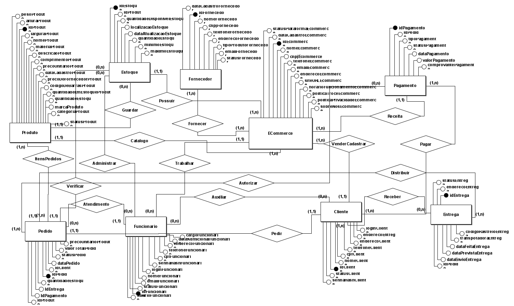
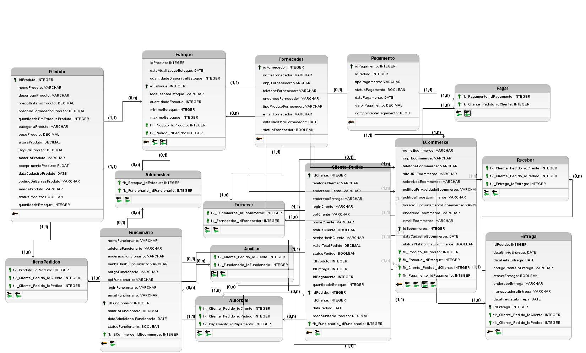

# 📦 Modelagem de Banco de Dados — E-commerce

Este projeto tem como objetivo representar a modelagem de dados de um sistema de E-commerce, desde o modelo conceitual até o modelo lógico, utilizando a ferramenta **brModelo**.

---

## 🧠 Objetivo da Atividade

A proposta consiste em construir uma base de dados que represente todas as entidades envolvidas no funcionamento de uma loja virtual. A modelagem contempla:

- Cadastro de produtos, clientes e funcionários
- Controle de estoque e fornecedores
- Gerenciamento de pedidos, pagamentos e entregas
- Relacionamentos entre e-commerce, clientes e pedidos

---

## 📌 Etapas Desenvolvidas

1. **Modelo Conceitual**
   - Criado utilizando o modelo entidade-relacionamento (MER)
   - Com todas as entidades, atributos, relacionamentos e cardinalidades definidas

2. **Modelo Lógico**
   - Conversão do modelo conceitual para tabelas relacionais
   - Atribuição de tipos de dados adequados para cada campo
   - Definição de chaves primárias e estrangeiras

---

## 🖼️ Diagramas

### 📘 Modelo Conceitual

---

### 🗃️ Modelo Lógico

---

## 💡 Ferramenta utilizada

- 💻 **brModelo** (versão 3.2.0)
- 📁 Exportações dos modelos em PNG
- ⚙️ Conversão automática do modelo lógico para o modelo físico (script SQL)

